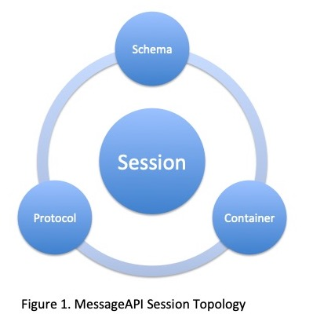
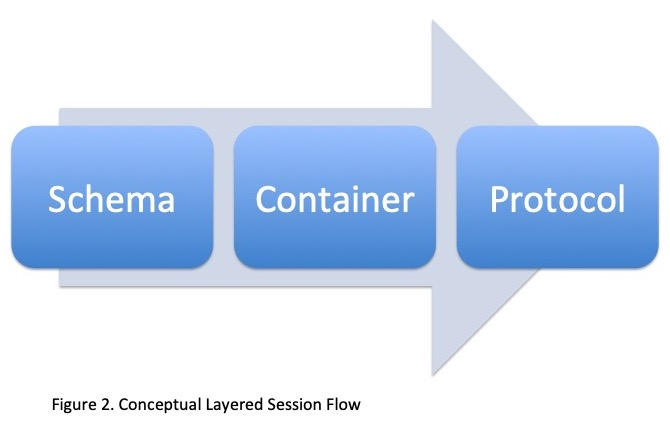
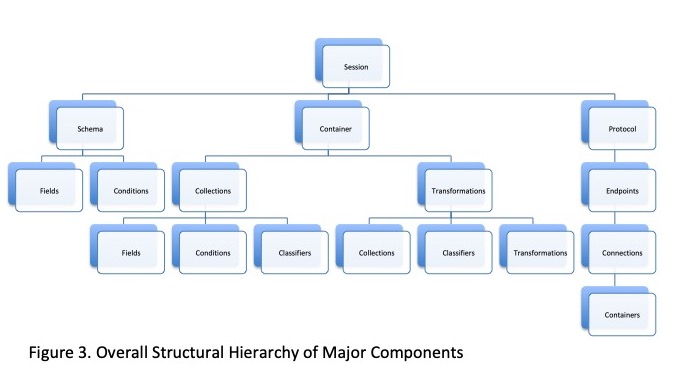
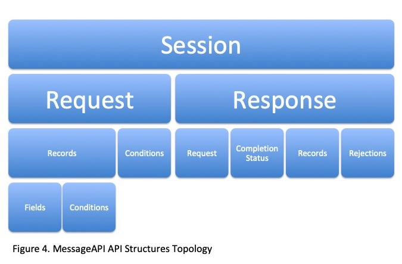
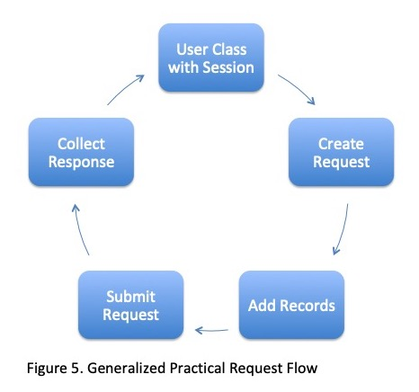
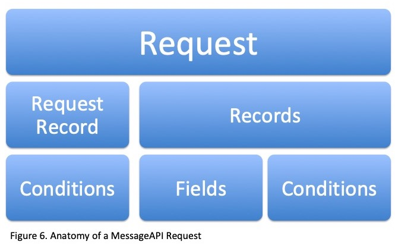
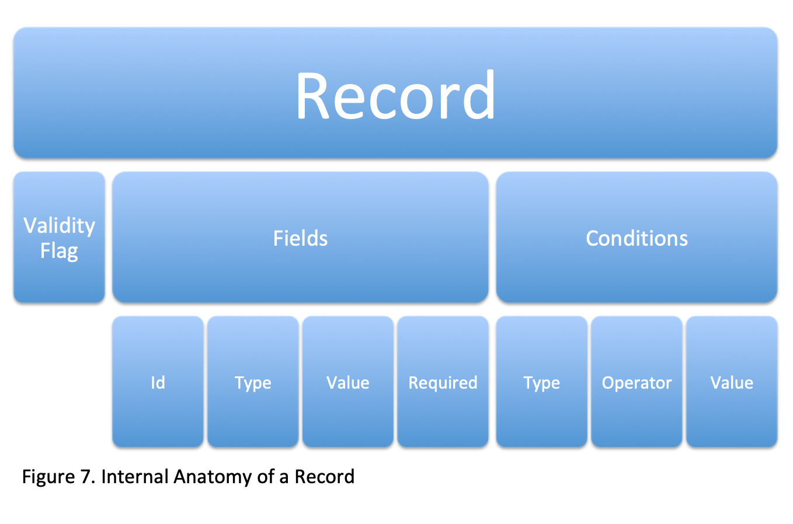
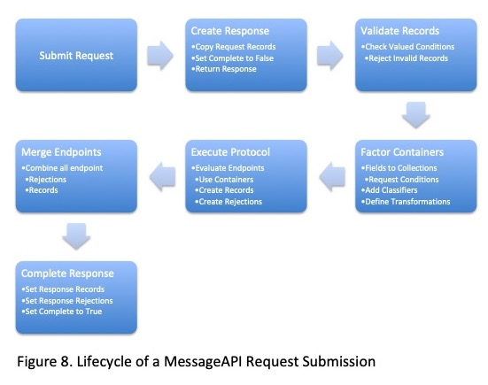

# MessageAPI

## Version

**0.9.10** (Pre-Release)

MessageAPI uses [Semantic Versioning 2.0.0](https://semver.org/) as its versioning strategy. The first official version will be released upon the implementation of the C native API and validation of the Java core. Subsequent minor versions will release the Fortran, Python, R, and IDL APIs, and Bash CLI.

## API Docs

Use of this package is described throughout this README through design discussions and examples. Once familiar with the general use case of the package, more complete [API Docs](./dist/docs/api/messageapi_docs.tar) can be downloaded and referenced (open index.html after extracting the tar).

## Executive Summary

MessageAPI was built to promote and improve the long-term sustainability and enterprise-scale innovative capabilities of large research and operations organizations like NCEI, NESDIS, and NOAA. A simple and static (never changing) language-level API provided in multiple languages together with a completely configurable process configuration allows fast augmentation of legacy code to use evolutionary features, allows teams to reuse existing algorithms, and ensures that code-level details don't have to change as interface-level technologies evolve. The idea is to provide a capability so that Java/JVM C/C++ Fortran Python, R, and IDL programmers can continue to use their own preferred technologies to do research and development, while ensuring that they can continue to evolve along with emerging organizational requirements and trends, without making code changes.

MessageAPI has a small multi-language core that is easily installed on mission systems as a non-root user using the mature build system; allows whitelisting of executable resources and configuration-level exposition to maintain visible security; and provides a thread-safe, asynchronous, stream and batch capable data model to build composable, scalable, and orchestrated computational processes. MessageAPI abstracts conditional filtering, stateless transformation, and bidirectional endpoint processing into JSON configuration.

## Overview

MessageAPI is a structured-data-processing specification designed to allow the development of decomplected, transparent, easily understood, evolutionary, and highly configurable process oriented systems. MessageAPI does this by drawing a domain distinction between process structure (the 'Message' of MessageAPI) and data (the 'API' part) and then providing complimentary orthonormal bases that span each space. The structure and data domain definitions of MessageAPI are based on the principles of generic programming and designed using the language of Communicating Sequential Processes (CSP) in order to be easily picked up and understood by different audiences and users.

MessageAPI is ultimately a specification for data-process pipelines, but for practical purposes it is also an implementation that consists of a default **Session** that sets itself up using a declarative JSON specification of the MessageAPI structural model (through a manifest and parameter map), and then allows data to be formulated using the **Request** and **Response** APIs to process batch and/or streaming Requests asynchronously. In the provided Session implementation, Requests terminate on **Endpoints** which can be thought of as defining the terminus of a given computation. Endpoints are provided an interface and an abstract base class to extend. Endpoints have access to the data passed through MessageAPI as **Records**, which can be held in any number of *containers* - such as **Collections**, **Classifiers**, and **Transformations**.  

Collections are Record set containers, Classfiers are potentially cross-Collection Record containers, and Transformations are containers of Records which apply some manipulation on other containers (including other Transformations). In contrast with Endpoints, Transformations are more open ended, providing an interface to implement. Transformations exhibit lazy processing behavior that is only executed when they are referred to in an **Endpoint**. In MessageAPI, Transformations always get their own copies of inputs, making them easy to use without worrying about shared system state.

*Caveat - if users provide their own Record Field 'types' (i.e., other than string, integer, float, etc.) that are some complex object, to make this guarantee, users must provide and call a 'deep copy' on each object in the record Field. Only standard types in the shipped default implementation guarantee immutable Transformations.*

By providing a shared mechanism for batch and stream operation, the default Session of MessageAPI is extremely flexible and allows code reuse for both modes. In the Default MessageAPI Session, streaming behavior can be accomplished by submitting a Request, updating its record with a new value, and resubmitting the same Request - a new response is generated for every Request, but they return asynchronously, so no blocking occurs. As Endpoints only initialize per-Request, endpoints also share state in this operation - this makes it possible to have long running endpoints (like other MessageAPI Sessions). Batch mode can be accomplished by creating a new Request for every new set of data - in this mode, Endpoints are reinitialized based on Session parameters, and hold independent state.

There are tests included in the package (including example Transformations and Endpoints) that demonstrate the use of MessageAPI for simple but ubiquitous use cases (like loading records from files). In one of the included tests, a ~80k line variable-byte-line file is read in as individual line records, each then holding the line number, value, container source, container type, and originating file name - in around 3/10ths of a second. This Endpoint is configurable enough to allow adjustment of Record Fields, and which Collections, Transformations, and/or Classifiers contain Files, entirely from configuration. While MessageAPI obviously isn't computationally 'free' (i.e., it can't compete with a straight buffer read of lines into an array-list) we are of the opinion that this test demonstrates that the benefits of MessageAPI, such as its extreme flexibility, code reuse potential, configurable control, and metadata inclusion, outweigh the overhead incurred in performance.

## Motivation

The Scientific Software Reengineering/Rearchitecting Group (SSRG) at NOAA NCEI is tasked with taking large, long-lived, evolutionary, polyglot, mission-critical, scientific research projects and/or systems, analyzing them through a lens of long term sustainability and security, and then reorienting them toward those general goals, while rejuvenating them to integrate with up to date and/or future organizational trends.

This process usually involves integrating with existing development teams, defining the project surface, performing an overall maturity assessment, performing individual process assessments on project subsystems (according to general principles of process performance systems like CMMI), and then (based on the assessment results) iteratively improving the overall system (this process is called 'Rejuvenation' at NCEI) - generally in order of testability, reliability, changeability, efficiency, security, maintainability, portability, and reusability (the SQALE method).

As the SSRG Rejuvenation program itself has matured, organizational patterns in the program's constraint parameters (character of systems under study, NCEI infrastructure and trends) have emerged. Based on these patterns, SSRG has endeavored to create and maintain an 'SSRG Toolbox' - a collection of generalized tools that standardize one or more aspects of the Rejuvenation process (assessment, testing, development, deployment). Some tools in the toolbox are commercial and/or organizational tools like Docker, Git, Jenkins, Slack, Understand, valgrind, gdb, JIRA, Google Docs - and some are custom tools like the FortranCommons (comprised of fortran language unit tests and properties, written in fortran), Harness (a data-oriented testing framework, written in python), and TaskAPI (a polyglot declarative workflow abstraction, written in java).

The TaskAPI tool was initially developed to replace Bash as the 'glue' for ASOS Ingest jobs, and was subsequently split from that project and made generic enough for any distributed computation project. TaskAPI provides distributed workflow parallelization capabilities, job control, declarative task definition, and logging standardization for the 3 language (fortran, java, c) ASOS Ingest system. It was also designed to promote iterative system improvement - allowing a quick load of existing project code into TaskAPI, and then allowing monolithic job tasks to be broken up into smaller tasks (and corresponding TaskAPI tasks) by factoring code over time. This iterative improvement and the end goal is still an ideal, but there is often a need for intraprocess tasks (e.g., a deeply nested x = system('ls -l'), or system('mail -s 'missing data!' bigArrayContents')) to be replaced first, or instead of, whole scale task splitting.

TaskAPI does allow for arbitrary data to be passed between fortran, c, and java through a map structure, but the map changes are only communicated during native method invocation or return. In the case of ASOS Ingest it was also discovered that there was widespread use of a binary Fortran Direct Access file storage package throughout. This Direct Access storage turned out to be the primary storage container for the intermediary Low Resolution data format (CLISAM) which serves as the basis for almost all LowRes derived products - including ISD, SODGraph, HPD, and US-CLIMAT, among others. Removal of the direct access storage media of CLISAM is a major priority for several reasons, including - the format was shown to be brittle during operating system port; the data would be much more useful and easier to use organizationally if it were stored in something like a Kafka topic.

All of these use cases added up to the need for a new tool to provide generalized intraprocess communication. This is what MessageAPI was primarily designed to do - replace targeted intraprocess communication in native languages with a standardized, stable, general, flexible, and portable mechanism. Due to type system differences across languages, the system would have to

- have a small, static API (any message would need to be transferred through a small set of bounded API methods)
- able to handle inward or outward directed messages
- be able to work in a non-blocking or blocking fashion

Due to the nature of the Rejuvenation work of SSRG, the tool would also have to conform to and promote SQALE standards. These requirements were interpreted to mean the system should

- be highly configurable outside of code
- be integratable in a potentially multi-threaded and/or multiprocess environment
- be generic enough to handle unknown use cases
- allow easy testing without complicated mocking
- be stable enough to be reliable for decades or more
- be extensible/changeable enough to be replaced if organizational standards changed
- be efficient in processing
- conform to organizational security standards
- be reusable
- be understandable to current system developers and future maintainers

All of these requirements added up to creating a specification first, and then writing a couple of implementations. Once the specification was designed and written, it became apparent that MessageAPI could handle the type of messages it was designed for, and potentially be extended for other use cases - distributed computation, system deployments, requirements management, versioning, etc.

## Philosophy

MessageAPI is designed with the belief that all processes are fundamentally simple, similar, and understandable. MessageAPI was designed to expose these process characteristics by the use of a simple (in the decomplected sense) information model.

Every part of how a MessageAPI defined process will play out, down to the implementation classes, is laid bare in a pair of text based maps - one for the manifest, and one for the parameters. These maps makes trivial work out of reasoning about how a program is structured and will run before it is ever executed.

The primary dimensions of MessageAPI are held to three - A **Schema** holds a flat map of all fields and conditions a user will interact with; a **Container** defines how fields will be factored and held in collections, classifications, and transformations; and a **Protocol** defines Endpoints and connections to them, which define where containers of records will go. All of these parts of a Message are viewable and configurable without touching code. Users write and share their own custom Endpoints and Transformations, which are then specified in the map.

Figure 1 below illustrates the layout of a Session - how MessageAPI structures all Processes.



Everything that passes data in MessageAPI consumes and produces the same object type - the record. The manifests are used in code by creating a session based on them - and then using a stable API to create a request, add records, set field and/or condition values, and then submit, which immediately returns an async response. The response will hold its own records and rejections, and eventually get an 'isComplete' flag. That's the entirety of the API surface. Everything else depends on the Manifest.

MessageAPI is designed to be capable of passing any message content - objects, database entries, emails, etc., to/through anywhere - database tables, inboxes, s3 buckets, ftp, smtp, kafka, files, directories etc.

The benefits of using MessageAPI are its extreme schema flexibility, potential for tool decoupling and transport optimization, API standardization across all messaging, and self documentation through an information model.

It's important to point out that even though it's called MessageAPI, the provided implementations do not replace message tools like ActiveMQ, RabbitMQ, Spark, or Storm. Really, no tools are 'replaced' by this one. MessageAPI is fundamentally a process specification, and the provided implementation is a small (3MB total package size) universal connector. This means that other messaging systems could of course be used with MessageAPI - linking response steps, serving as input or output queues, or transformation steps. Even MessageAPI sessions can be endpoints for MessageAPI sessions.

## Package Contents

This package includes the MessageAPI specification as a set of interfaces, useful implementations that can perform batch and stream publication/consumption, and several tests that demonstrate common data processing tasks to provide an idea on how to build systems. The Java part of the core MessageAPI implementation is written almost entirely in Java8/9+ core, taking advantage of the Java Streams and Flow packages, with only one external dependency - a JSON parser - due to the lack of a core Java version. Similarly, APIs provided for any other languages found in this package (currently planned are C, Fortran, and CPython) - are written in their respective core languages. Endpoints and Transformations are left to the joy of the user and their domain.

### Description

Using MessageAPI means taking a data-messaging process, defining the process alphabet in terms of fields and conditions, determining how those fields are contained as different record permutations (including any transformations or conditions that affect that containment), and determining what to do with the records. All this information is then laid out in the session manifest and parameter map, and then data is moved through the initialized session by submitting records as either discrete requests, or resubmitting new records as a stream on the same request.

As previously described, in the provided implementation of the DefaultSession, records can be moved through the system in batch by using separate requests, or in stream by reusing the same request. When streaming over the same request, endpoints have a shared state over submissions.

The MessageAPI information model manifest is completely pluggable and is read when specifically referenced at runtime in code (i.e., ISession s = new Session('manifest.json')). This allows targeted improvements or modifications of the standard. Want to change the containers to ship somewhere else? Build Docker containers? Make Requests enforce always-batch behavior? Change the container plugin, or another plugin, and reuse the rest.

The complete pluggability of MessageAPI also provides another powerful potential - creation of Sessions at-a-distance. This opens the MessageAPI system up for complete and total automation by things like REST services, driver programs, GUI's, etc.

The default MessageAPI session provides a standard topology that will suit many messaging tasks (either publishing or consuming oriented, batch or stream oriented), along with providing a matching set of basic plugins. The provided implementations are well suited for individual or distributed use. For example, a MessageAPI session could be wrapped as a Kafka consumer, deployed as a single runtime pod in Kubernetes as a consumer group, started up, and then fed records coming from a service. Or a session could be used intra-process to send emails to different groups based on different conditions. Or, as recently discovered, MessageAPI could serve as the in-core engine for custom Apache NiFi processors. There are a lot of varied uses.

The following is an example of a DefaultSession manifest:

```json
{
    "plugin": "gov.noaa.messageapi.sessions.DefaultSession",
    "constructor": {
        "schema": {
            "plugin": "gov.noaa.messageapi.schemas.DefaultSchema",
            "constructor": {
                "metadata": "{}/resources/test/metadata/file-reader/schema.json",
                "fields": "{}/resources/test/file-reader/parameters.json",
                "conditions": {
                    "map": "{}/resources/test/file-reader/parameters.json",
                    "factory": "gov.noaa.messageapi.factories.SimpleConditionFactory"
                }
            }
        },
        "container": {
            "plugin": "gov.noaa.messageapi.containers.DefaultContainer",
            "constructor": {
                "metadata": "{}/resources/test/metadata/file-reader/container.json",
                "collections": "{}/resources/test/file-reader/parameters.json",
                "transformations": {
                    "map": "{}/resources/test/file-reader/parameters.json",
                    "factory": "gov.noaa.messageapi.test.factories.transformations.FileReaderFactory"
                }
            }
        },
        "protocol": {
            "plugin": "gov.noaa.messageapi.protocols.DefaultProtocol",
            "constructor": {
                "metadata": "{}/resources/test/metadata/file-reader/protocol.json",
                "endpoints": [{
                        "plugin": "gov.noaa.messageapi.test.endpoints.InMemoryFileReader",
                        "connections": "{}/resources/test/file-reader/parameters.json"
                    }]
            }
        }
    }
}
```

The general pattern in a manifest is to declare a key with the class as the plugin, and then provide another map that holds constructor parameters. The specification for MessageAPI consists of:

- A **Session**, which holds the primary **Schema**, **Container**, and **Protocol** dimensions
- A **Schema**, which defines all the **Fields** and **Conditions** (optional) a user will interact with for each **Record**
- A **Container**, which defines any way a **Field** set will be contained - **Records** (**Field** and **Condition** sets) are each factored into **Collections**, **Collections** hold arbitrary **Classifiers** (optional), and **Transformations** (optional) can refer to **Collections**, **Classifiers**, **Transformations**, or entire **Records** (every **Collection** that a specific **Record** was factored into).
- A **Protocol**, which defines the Endpoints that record containers are sent to for processing. There can be multiple Endpoints per manifest, and multiple connections per session. Each Endpoint connection will hold and manage state independently of each other, in terms of the Request logic previously described (as far as batch vs streaming).

In more descriptive detail, Sessions are the primary abstraction in MessageAPI. Sessions in turn consist of Schema, Container, and Protocol abstractions, and each of these has its own set of properties that must/can be specified. Notice that in the example spec, any key labeled "plugin" points to a class. These classes are what are read at runtime (when the spec itself is referenced in the code). Anything found within the "constructor" map is then used by the class to build itself.

So, for example, if the above spec is taken literally, when it is used in the code, an instance of the "class.namespace.SessionPluginClass" class is loaded with the corresponding "constructor" map passed in as the constructor argument. This in turn kicks off the system to read the Schema, Container, and Protocol classes and create those using their own constructor maps. The information found in the associated key-values (usually referencing an underlying JSON map, with the exception being the "operators" key in the schema constructor) will be read and parsed at that time to build the component and ultimately the session.

Note that both Conditions and Transformations specify 'factories'. These factories have key/value associations in switch statements that return (either a Condition or Transformation) depending on the key in the parameter map. This is done for different reasons in each context - in the case of Conditions, this was done to both prevent the parameter map from becoming too large, and provide a way for Conditions to be easily extended to arbitrary user types. In the case of Transformations, this was done to ensure a level of security in what code may be executed in performing data manipulation. Because MessageAPI uses reflection to build the system, this pattern ensures only code compiled on the classpath can be run as a transformation.

*Notice that in this map, the **Fields, Conditions, Collections, Transformations,** and **Connections** all refer to the same 'parameters' map:*
***Also note - the only 'required' things are 'fields', 'collections', and 'connections'. If the other parts aren't needed (conditions/transformations/metadata), don't reference them in the manifest and don't include them in the parameters.***

```json
{
    "fields": [{"id": "file-path",
                "type": "string",
                "required": true}],
    "conditions": [{"id": "is-relative-path",
                    "type": "comparison",
                    "operator": "contains",
                    "field": "file-path",
                    "value": "{}"}],
    "collections": [{"id": "coll-1",
                     "classifiers": {},
                     "fields": ["file-path"],
                     "conditions": ["is-relative-path"]}],
    "transformations": [{"id": "trans-1",
                         "operator": "gov.noaa.messageapi.test.transformations.FixRelativePathsTransformation",
                         "constructor": {"transform-key": "file-collection",
                                        "fields": ["file-path"]},
                         "records": {"file-collection": {"COLLECTION": "coll-1"}}}],
    "connections": [{"id": "conn-1",
                     "transformations": ["trans-1"],
                     "constructor": {"file-fields": "file-path"},
                     "fields" : ["value","number", "length"]}]
}
```

*These parameters can be split up into separate files or held together like they are here. Each of these domain concepts will be explored in more depth further down.*

Once built, this session is then in memory and can be reused as often as necessary (subsequent requests do deep-copies of loaded session components). MessageAPI trades initial speed of compile-time class construction for the flexibility and declarative nature of doing it at runtime (although the initial bootstrapping is generally very fast, as the provided MessageAPI implementation footprint is small). *Sessions can, for example, be passed as objects to different machines, different thread groups, etc. and used to construct brand new, guaranteed-isolated requests from the same template.*

Each session component is considered a fundamental and loosely orthogonal dimension of its parent. Every message session, no matter what the type, can be created by specifying the three primary dimensions (Schema, Container, and Protocol), and this concept is what allows MessageAPI to provide a powerful and lightweight abstraction on top of arbitrary messages. Each of these dimensions has its own particular properties which define it. All also include a catchall and optional 'metadata' property for storage of other useful self-documenting information, such as version or identifying labels.

#### MessageAPI Session Topology

We saw earlier that MessageAPI works by separating out structural and dataflow concerns. Figure 2 illustrates how data typically flows between structural dimensions:



Figure 3 illustrates the Hierarchy of all Structural Components. We will delve into each below.



##### Schemas

Schemas are what define records as seen by the Session holder. This is the part of the topology which defines what fields a record will have, any conditions on those fields, and an operator factory class that provides methods on evaluating fields against conditions (conditions may contain arbitrary logic).

Here we see that Schemas refer to a plugin class, and the constructor used to create the plugin.

```json
"schema": {
    "plugin": "gov.noaa.messageapi.schemas.DefaultSchema",
    "constructor": {
        "metadata": "{}/resources/test/metadata/file-reader/schema.json",
        "fields": "{}/resources/test/file-reader/parameters.json",
        "conditions": {
            "map": "{}/resources/test/file-reader/parameters.json",
            "factory": "gov.noaa.messageapi.factories.SimpleConditionFactory"
        }
    }
```

Schemas contain **Fields** (required), **Conditions** (optional), and **MetaData** (optional).

###### Metadata

The MetaData becomes part of the definition when the manifest is loaded, and can be accessed from the endpoint layer this allows for interaction with mutable endpoint schemas when field sets change over time (for example, Avro storage in Kafka).

```json
{
    "metadata": {
        "id": "the-schema-id",
        "version": 1.0,
        "classifiers": {},
        "description": null
    }
}
```

Metadata is loaded from map to a Metadata object for convenience, so that API methods can sanely get different properties. Metadata, along with every other user-available concept in MessageAPI, is also programmed against an interface, so the available methods are available in the constructed groovydocs to peruse for that particular interface.

###### Field Sets

A Schema Field set is a flat set of field definitions - for example, software that wants to pass email messages through MessageAPI could have a field set of 'address, subject, body'. (Alternatively, the fields could just be key/value pairs of arbitrary content, and the 'target/subject' could be constructor parameters.) Schema Field sets should hold every Field in any collection that the user will use. So if there are two lists of two different record types feeding into a MessageAPI process, with different domains, fields from both lists should both be declared in the Schema Field map. The containment of different Field sets can be specified at the container level as Collections (ie, create two collections at the container level and hold fields for one set in the first container, and fields from the other in the second container). This pattern allows a clearly defined global field set while allowing an arbitrary number of record types to be part of a given processing action.

In the provided schema class, fields need to be provided with a 'name', 'type', and 'required' properties.

The 'name' must be unique in the schema, the 'type' must be understood by the parsing class, and the 'required' must be a boolean. If a field is required but not provided, that record will be immediately rejected on request submission.

In the provided implementation, the types understood by the system (for use by conditions) are 'string', 'float', 'double', 'integer', 'datetime', and 'boolean'. Without adjustment, other types can be handled without issue, although to use the condition system, additional types should be added. This can be done easily by adjusting the ConditionFactory.

```json
{
    "fields": [
        {
            "name": "id",
            "type": "integer",
            "required": false
        },
        {
            "name": "key",
            "type": "string",
            "required": true
        },
        {
            "name": "record",
            "type": "string",
            "required": true
        },
        {
            "name": "filename",
            "type": "string",
            "required": true
        },
        {
            "name": "type",
            "type": "string",
            "required": true
        },
        {
            "name": "receipt_date",
            "type": "datetime",
            "required": true
        },
        {
            "name": "insert_date",
            "type": "datetime",
            "required": true
        }
    ]
}
```

###### Condition Sets

Conditions can be set on fields that qualify records when passed in, serving as a potentially powerful dynamic filtering tool. In the provided default plugin, conditions must specify at least a unique id, a type, and an operator. Conditions that are to be used in filtering must be valued on individual records. Conditions are also provided on a whole-request basis - to be used in containerization of records. In this case, conditions can be given values on the request itself, to be used for parsing into collection-containers by applying to every potential record that is declared as part of a collection set.

There are two condition types in the provided implementation  - composite and comparison.

Comparison type conditions are direct comparisons (things like equivalency, greater than, contains, etc.) while composite conditions reference other conditions and specify either an 'and' or an 'or' operator. This allows multiple conditions to be nested, referenced by their IDs.

Composite conditions can also include other composite conditions and will be unpacked and applied recursively, in whatever context is specified by the session type in the manifest. The only global restriction for the given implementation is that conditions cannot be self referential (no infinite loops).

```json
{
    "conditions": [
        {
            "id": "1",
            "type": "comparison",
            "operator": ">=",
            "field": "key",
            "value": null
        },
        {
            "id": "2",
            "type": "comparison",
            "operator": "<",
            "field": "key",
            "value": null
        },
        {
            "id": "three",
            "type": "composite",
            "operator": "or",
            "conditions": ["1","2","hi"]
        },
        {
            "id": "hi",
            "type": "comparison",
            "operator": "=",
            "field": "type",
            "value": null
        },
        {
            "id": "relative-path",
            "type": "comparison",
            "operator": "contains",
            "field": "filename",
            "value": "{}"
        },
        {
            "id": "nested_join",
            "type": "composite",
            "operator": "and",
            "conditions": ["relative-path", "three"]
        }
    ]
}
```

##### Containers

The **Container** dimension of a MessageAPI Session represents groupings of Schema information (Fields and/or Conditions). Because all Records are defined from a single flat schema, Containers allow records to specify how they are factored/binned, and then additionally given classifier information and computational specification. In the Session manifest, like the other two dimensions, the Container contains a plugin and a constructor. The constructor defines where to find

- metadata (optional)
- collections (required)
- transformations (optional)

Transformations, if specified, must specify both a map of connections, and a factory. The factory contains key/value pairs of transformation handles and transformation classes, each of which implement the ITransformation interface. The map property provides the location for a list of transformations, described further in this README.

```json
"container": {
    "plugin": "gov.noaa.messageapi.containers.DefaultContainer",
    "constructor": {
        "metadata": "{}/resources/test/metadata/file-reader/container.json",
        "collections": "{}/resources/test/file-reader/parameters.json",
        "transformations": {
            "map": "{}/resources/test/file-reader/parameters.json",
            "factory": "gov.noaa.messageapi.test.factories.transformations.FileReaderFactory"
        }
    }
}
```

There are three types of container groupings provided by the default MessageAPI implementation - **Collections**, **Classifiers**, and **Transformations**.

###### Collections

- **Collections** are the most basic containers, and are the only type required in a session manifest. Collections specify a session-global unique id, a list of fields that belong to them, a list of conditions that must be met before a record will build into one, and optionally, a map of classifiers (keys with arbitrary values). When a request is submitted, the list of records attached to the request at submission time is mapped to collections. Each record individually is broken into whatever collections are specified. These collections are immutable - they can overlap fields, even containing the same identical field sets, and each one will get its own independent copy. After grouping, collections derived from the same Record are still tied together by a separate UUID that is attached to each.

```json
{
    "collections": [
        {
            "id": "required-fields",
            "fields": ["boolean-required", "float-required", "double-required", "integer-required", "string-required", "datetime-required"],
            "conditions": ["cond-1", "cond-2"]
        },
        {
            "id": "optional-fields",
            "fields": ["boolean-optional", "float-optional", "double-optional", "integer-optional", "string-optional", "datetime-optional"]
        },
        {
            "id": "mix-and-match",
            "fields": ["string-required", "string-optional", "datetime-required"]
        }
    ]
}
```

###### Classifiers

- **Classifiers** are metadata containers, in that they are not specified directly in the Session manifest, but are attached to Collections. A single Classifier can be attached to different Collections, and this mechanism provides a guarantee of the ability to arbitrarily group Records in MessageAPI. These Classifier labels are then available separately for use in Transformations and/or Endpoints - retrieving a Classifier in an Endpoint or using it as an input of a Transformation will retrieve all records from all collections labeled with that Classifier, no matter which Collection it lives in. Determination of the potential utility of this mechanism is left to the user.

```json
{
    "collections": [
        {
            "id": "required-fields",
            "classifiers": {"namespace": "condition-test"},
            "fields": ["boolean-required", "float-required", "double-required", "integer-required", "string-required", "datetime-required"],
            "conditions": ["cond-1", "cond-2"]
        },
        {
            "id": "optional-fields",
            "classifiers": {"namespace": "condition-test"},
            "fields": ["boolean-optional", "float-optional", "double-optional", "integer-optional", "string-optional", "datetime-optional"]
        },
        {
            "id": "mix-and-match",
            "classifiers": {"namespace": "condition-test"},
            "fields": ["string-required", "string-optional", "datetime-required"]
        }
    ]
}
```

###### Transformations

- **Transformations** are computational containers. They are an optional component of MessageAPI. Transformations act as instances of immutable functions that can hold global, configurable constructor/initialization parameters, use other arbitrary named containers as arguments in a process function, return a list of records, and list the fields that each record will provide in a 'fields' map entry. Transformations are always immutable, executed lazily (only when called in an Endpoint), and always operate on and produce lists of records.

The 'records' entry on the Transformation map itself holds a map of named parameter keys that correspond to values describing what type of container and the id of that container to use as that particular input. For example, in the following Transformation map, the first Transformation is called 'join-test'. The Transformation has an operator of the fully qualified join Class listed in the Session manifest. This Transformation provides a constructor map containing two keys, 'join_field' and 'collection_field', both which specify constants that are set in the Transformation when it is initialized.

The 'join-test' Transformation defines three parameters in its process method map - 'parent', 'child', and 'other'. Each of these corresponds to a different container - when used in the Transformation, the 'parent' parameter will provide a list of all records contained by the 'namespace=condition-test' classifier; the 'child' parameter will provide a list of records contained by the 'mix-and-match' collection; and the 'other' parameter contains a special case - the UUID - which will provide every collection for a given UUID, and map the Transformation to every UUID, and all returned records for every UUID in this Transformation will be merged on return. The use of UUID as a Transformation record parameter is a special case, and due to its mapping ability, limits its use to once per Transformation.

The 'join-test' Transformation also specifies that it will return the 'key', 'record', filename', 'type', and 'mix-and-match' fields. This is useful for knowing in a configurable way what fields to expect for use in other Transformations or Endpoints. However, at this time, there is no restriction on what fields a Transformation can return.

In the second Transformation, the 'reduce-list' record parameter will provide all records contained by the 'join-test' Transformation. In practice, for the provided default MessageAPI implementation, when the 'reduce-test' Transformation is invoked, it will first invoke the 'join-test' transformation and used those returned records as input for its 'reduce-list' parameter. Transformations are always evaluated lazily in this manner, whereby they are only invoked when called, and chained/referenced transformations are similarly only invoked to provide an input to their parent when invoked.

It is the view of the package authors that Transformations hold computational tasks and List manipulations - Transformations are good places for things like Joins, Unions, Filters, etc. Any type of computation is technically allowed in a Transformation, but external behavior is better suited for taking place in Endpoints, which are specifically designed with external communication in mind.

```json
{
    "transformations": [
    {
        "id": "join-test",
        "operator": "gov.noaa.messageapi.transformations.joins.StringFieldJoin",
        "constructor": {"join_field": "key",
                        "collection_field": "mix-and-match",
                        "fields": ["key", "record", "filename", "type", "mix-and-match"]},
        "records": {"parent": {"CLASSIFIER": ["namespace", "condition-test"]},
                    "child":  {"COLLECTION": "mix-and-match"},
                    "other": "UUID"}
    },
    {
        "id": "reduce-test",
        "operator": "gov.noaa.messageapi.transformations.reductions.ReduceTransformation",
        "constructor": {"reduce-field": "mix-and-match",
                        "reduce-target": "mix-and-match-reduction",
                        "fields": ["key", "mix-and-match-reduction"]},
        "records": {"reduce-list" : {"TRANSFORMATION": "join-test"}}
    }]
}
```

###### Container Metadata

Additionally, like **Schemas** and **Protocols**, **Containers** may provide a metadata map in the Session manifest. This metadata map is formed identically to the other metadata maps.

```json
{
    "metadata": {
        "id": "condition-test",
        "version": "1.0",
        "classifiers": {},
        "description": null
    }
}
```

##### Protocols

The Protocol dimension of MessageAPI represents the boundary of a MessageAPI process. The Protocol holds **Endpoints** and Endpoint **Connections**. The Protocol is the part of the MessageAPI that grabs records from Containers, communicates out of process, and returns a data Packet containing its own Record and/or Rejection lists back to the original caller, to be merged with all other Records and Rejections retrieved from other Endpoints. Endpoints can do anything with Records - send emails, push to FTP or object storage, retrieve content from a Kafka topic, run unit tests, etc. All processing in the Endpoint Connections runs asynchronously in the context of a Request, meaning the original caller doesn't have to wait for any processing to complete or care about what output is returned.

Similarly to the Schema and Container dimensions of a Session, the Protocol key in the manifest specifies a Protocol class and a map of parameters used in the class construction. Constructor keys in a Protocol include **metadata**(optional) and **endpoints**(required). Endpoints are specified as classes that must be available on the classpath at runtime - each Endpoint must at least have one Connection. Each Endpoint specifies its own Connection map.

```json
"protocol": {
    "plugin": "gov.noaa.messageapi.protocols.DefaultProtocol",
    "constructor": {
        "metadata": "{}/resources/test/metadata/file-reader/protocol.json",
        "endpoints": [{
                "plugin": "gov.noaa.messageapi.test.endpoints.InMemoryFileReader",
                "connections": "{}/resources/test/file-reader/parameters.json"
            }]
    }
}
```

###### Endpoints

The Protocol layer can hold arbitrary Endpoints, and arbitrary Connections for every endpoint. Each Endpoint Connection has its own isolated state during computation, and the specific containers it has access to, along with any initialization parameters, are specified out of code in the configuration. Endpoints generally extend the provided AbstractEndpoint class, which requires Endpoints to provide a list of default fields that will be used in creation of an Endpoint Record. Similar to Java Runnables, Endpoints all have a single method that gets called when the endpoint connection is encountered during Request submission. Within this method, Endpoints can access the records in whatever containers are available to them as specified on the connection map.

###### Connections

Endpoints are written as classes and initialized using configurable Connection maps. Every Connection represents an 'instance' of a specific Endpoint. Here is an example of a connections map used by an email type endpoint:

```json
{
    "connections": [
        {
            "id": "1",
            "collections": "*",
            "transformations": ["join-test"],
            "fields": [],
            "constructor": {
                "sender": "ryan.berkheimer@noaa.gov",
                "password": "testpassword1234",
                "receivers": ["rab25@case.edu", "ryan.berkheimer@noaa.gov"]
            }
        },
        {
            "id": "2",
            "collections": ["*"],
            "classifiers": {"namespace": ["/path/to/test.db"]},
            "transformations": [],
            "fields": [],
            "constructor": {
                "sender": "jackson.pollock@cia.org",
                "password": "passpass64",
                "receivers": ["template1@org.org", "template2@org.org"]
            }
        }
    ]
}
```

Each Connection specifies a unique id (required), a constructor used to build the Endpoint instance (required), a list of collections (optional), map of classifiers (optional), list of transformations (optional), and list of fields (optional). General convention is that the list of fields determines what field set will be returned in each Endpoint Record in the returned Packet, although this isn't a hard requirement. The specified containers (i.e., collections, classifiers, and/or transformations) provided will alwasy be the containers that are associated with that connection map when that endpoint connection is processed.

*Note that there's a special character "\*" that allows specification of all containers of a certain type from the container layer.*

#### MessageAPI API and Examples

Now that we've described the general architecture, we will describe how a typical program will use this system using the API available.

Figure 4 demonstrates the entire topological surface of User-interactive parts of the MessageAPI system, the parts that structure the plumbing of how data will flow in a MessageAPI process.



All user-interactive parts of the MessageAPI model can be imported as interfaces. By convention, interfaces in MessageAPI begin with a capital I, followed by the word for the model component that the interface represents (no space). The most important interfaces of MessageAPI  that users will interact with are the ISession, IRequest, IRecord, and IResponse interfaces. Other user-useful interfaces are the IRejection, IField, IRelationship, and ICondition interfaces.

The overall strategy for using MessageAPI is straightforward:

Use the imported SessionFactory to create an ISession (pass the path to a specification like the one described above, or one in the package examples) - *alternatively, import and use the desired Session type directly*.

```java
import gov.noaa.messageapi.factories.SessionFactory;
import gov.noaa.messageapi.interfaces.ISession;

ISession session = SessionFactory.create("/path/to/session_manifest.json");
```

or

```java
import gov.noaa.messageapi.interfaces.ISession;

ISession session = new DefaultSession("/path/to/session_manifest.json");
```

Using the created Session object, create a Request - the Request type was baked into the session on session creation. All fields and conditions that define the Request Record template will be available from the same Record.

```java
import gov.noaa.messageapi.interfaces.IRequest;

IRequest request = session.createRequest();
```

Using the request, create as many records as needed directly on the request. For each record, set field values and/or condition values as needed. Every created record is automatically part of the request.

```java
import gov.noaa.messageapi.interfaces.IRecord;

IRecord record = request.createRecord();

record.setField("field-id", "value");
record.setCondition("condition-id", "condition-value");
```

In the provided MessageAPI implementation, all Conditions are nullified for individual Records (any values set in the parameter manifest are removed). Values must be explicitly set for individual records to filter them. MessageAPI checks every record individually for valid (valued) condition branches and then validates each record against only those valued paths.

We can also set Conditions directly on the Request if there are collection conditions specified in the Session Container:

```java
request.setCondition("condition-id", "condition-value");

```

Initial values set in Condition maps are maintained in Requests (they are not nullified), so these can be entirely set in configuration if desired. Valued condition branches are then applied to matching Container Collections.

**This Condition pattern maximizes utility of the Condition mechanism, allowing a single Condition map to hold all conditional logic for a Request, both in Containerization and Filtering Contexts, while allowing as much configuration as possible outside of code.**

Once the records are set, call submit on the request. This submission immediately creates a duplicate of the entire request inside a response object, and then returns. All logic is processed against that request copy and its parent response asynchronously. Inside a response, protocols can produce response records and response rejections.

```java
import gov.noaa.messageapi.interfaces.IResponse;

IResponse response = request.submit(); //asynchronous, returns immediately

System.out.println(response.isComplete()); //would initially return 'False'
```

When complete, the IResponse will flip isComplete() to true, and will have available IRecords and IRejections.

```java
import gov.noaa.messageapi.interfaces.IRejection;

if (response.isComplete()) {
    List<IRecord> responseRecords = response.getRecords();
    List<IRejection> responseRejections = response.getRejections();
}

responseRecords.stream().forEach(rr -> System.out.println(rr.getFields()));
responseRejections.stream().forEach(rr -> System.out.println(rr.getRecord() + ", " + rr.getReasons()));

```

Figure 5 demonstrates how data typically flows through the Request structure illustrated above.



Figure 6 provides more insight into the internal parts of a Request.



Figure 7 provides more insight into the internal parts of a Record, which parts can be set, etc..



The provided MessageAPI implementation is designed to be thread-safe in Requests across Sessions, and Responses across Requests ***with respect to Records***. This means that when a Request is submitted, the submitted Record set is deep copied to the Response. The Response will use the Endpoint Connection instances that were created when the Request was created. This means that the Endpoints across a given Request are potentially Stateful. Separate Requests are guaranteed to be isolated and thread-safe with respect to state.

This has important implications for use. If a stateful Endpoint is required, for example, some counting mechanism, or some situation where newer records depend on older, the same Request can be submitted multiple times (i.e., by calling request.submit()), with potentially different record sets (i.e., before calling request.submit() the second time, first call

```java
request.setRecords(List<IRecord> newRecords));
```

If isolated state is required, just create a new Request on the Session. All Endpoints and other stateful machinery will be re-instantiated for each Request.

In each case, Transformations are always stateless WRT Requests or Responses, because they are always recreated when called from an endpoint.

Figure 8 provides an entire, top down view of a Request Lifecycle.



##### API Examples

To illustrate a typical use case, we provide a simple example class that creates a new Session from manifest, creates a Request, Creates many Records on the Request for an arraylist of strings, submits the Request, and parses/prints out the Response Records and Rejections.

```java
package gov.noaa.messageapi.test;

import gov.noaa.messageapi.factories.SessionFactory;

import gov.noaa.messageapi.interfaces.ISession;
import gov.noaa.messageapi.interfaces.IRequest;
import gov.noaa.messageapi.interfaces.IRecord;
import gov.noaa.messageapi.interfaces.IResponse;
import gov.noaa.messageapi.interfaces.IRejection;

import java.util.List;

public class addRecordsTest {

    private ISession session;

    public addRecordsTest(sessionManifest) {
        this.session = SessionFactory.create(sessionManifest);
    }

    public void addRecords(List<List<String>> recordsToAdd) {

        IRequest request = this.session.createRequest();

        recordsToAdd.stream().forEach(recordToAdd -> {
            for (int i = 0; i < record.getFields().size(); i++) {
                record.setField(i, recordToAdd.get(i));
            }
        });

        IResponse response = request.submit();

        while (!response.isComplete()) {}

        if (response.getRejections().size() > 0) {
            for (int j = 0; j < response.getRejections().size(); j++) {
                System.err.println("Rejected record because " + response.getRejections().get(j).getReasons());
            }
        } else {
            response.getRecords().stream().forEach(record -> {
                System.out.println(record.getFields());
                record.getFields().stream().forEach(f -> System.out.println(f.getId()));
            });
        }
    }
}
```

To provide a brief explanation - we first create a persistent session object based on a given spec when the example class is instantiated somewhere else. This session that is created then immediately has a concretely-defined schema, container set, and protocol which were all based on some runtime loaded text files. These are now in memory, and can be quickly grabbed and reused on any children requests based on this session.

When the addRecords method in the above class is called with a list of strings, a request is first created from the session and then that request is  populated with records (using createRecord on the request) for every record that the user has. This is done by setting field values for the record - again, these fields are all in the declarative spec that was loaded when the session was loaded.

In this case, record field values are set by index. It is also valid to set record field values by named fields - there are use cases for both approaches. In this case we are not setting any record conditions, but those are done the same way as fields (record.setCondition(conditionID, conditionValue)).

Once we've finished populating our response with all of the records, we submit the request to the session and immediately receive a response. Requests are submitted asynchronously and copied-on-submit to mitigate any blocking and responses or mutability issues and are returned immediately even if their work hasn't yet finished. This means the submitter can keep working if they want, and hold the request for later use, wait for it to complete by monitoring an isComplete method, or toss it away if there's no need to make sure of the response.

When the response finally finishes, it will contain a set of final rejections (if any) based on conditions or based on a failed protocol action and final records. The rejections can be inspected individually for the record as well as reasons for the rejection, and the records can be consumed according to the original defined schema.

Because requests contain a copy of the session variables which created them, they can always be the source of truth for any properties that might be inspected later. Schema, Container, Protocol information can always be inspected later, and the user should be confident in knowing that the chain of custody for this data remained immutable since session creation.

##### Package Use

###### Prebuilt Resources
The package can be retrieved and used as a precompiled set of artifacts packaged as tar files. There are currently tar files for the core Java library and the precompiled C/C++ native library (compiled using the RHEL7 UBI, which is freely available from Redhat and compatible with Openshift). Each tar comes with an install.sh file that will install the relevant component for the current user. This means that for the Java package, the MessageAPI jar will be installed to a user directory, which will be added to the PATH and the Jar will be added to the CLASSPATH (if not already installed). The C library will add the shared library to the PATH and set up environment variables for use of the packaged header and source files. No root privileges are required to install or use the precompiled package resources. There is a central install script that will unpackage and install all components and relevant environment variables for you, for either "C_CPP" or "CORE". See below for instructions.

To install on a mission system at NCEI, do the following:

1. Make sure you are logged into the NCEI gitlab in the usual way. If you are logged, in, you will be able to access repositories.
2. Copy/paste the following five lines in a terminal one by one, hitting enter after each, for the user that will be using MessageAPI:
    - wget https://git.ncei.noaa.gov/sesb/sscs/messageapi/-/raw/master/scripts/install/package/install.sh?inline=false --no-check-certificate -O install.sh
    - chmod +x install.sh
    - ./install.sh "C_CPP"
    - rm install.sh
    - source ~/.bashrc
3. You now have access to all MessageAPI resources needed to build and run MessageAPI dependent software, including build templates, headers, and shared libraries. Convenient environment variables have also been set up in the bashrc (which are also used by build templates) - use a cat ~/.bashrc to see which ones are available.

###### Building From Source
When acquired through repository, the package can be built from source in order to run included tests. A Dockerfile for building the package is included in the resources/docker directory - this Dockerfile is based on the RHEL7 UBI and contains all necessary packages needed to build the MessageAPI system. This file can be used as-is or as a reference to guide what resources and conditions are necessary.

Important to note - because of the way MessageAPI handles Session bootstrapping, it is not required or even desired to bundle the MessageAPI core with user classes. As long as these are made available to MessageAPI on the Java classpath at Session creation within a JAR, Sessions will be able to use them. This design makes it easier to automate things like creating K8s pods of certain session types. 

Also important to note for native Session use - MessageAPI Core and any user classes must be included in a JAR (not necessarily the same JAR), and these JARS must be explicitly listed on the Java CLASSPATH (they cannot be included  using directory wildcard expansions). This is due to how the JVM is created during session spin-up. See the CLASSPATH variable in ~/.bashrc with the #messageapi_core_set_classpath comment to see how the core is included on the classpath. To include user class-containing JARS, just add them in a similar way.

If desired or needed, MessageAPI can be bundled into other JARS or packages containing user Factories and Endpoints for portability, performance, security, or other reasons.

### Configurations

### Instructions

## Installation and Deployment

At the time of this writing, MessageAPI was built and tested using OpenJDK 1.8 as well as 11.0.3 with gradle 5.4.1. Older JDK versions are not guaranteed to work.

There was a breaking change between older versions of gradle and the 5 series, and a relative path resolution
method was updated to accommodate this change. If building from scratch, the gradle version must be upgraded to 5.4.1+.

Once these two system dependencies are met, this package can be run with tests by running 'make' from the package root.

```Makefile
make
```

If tests complete successfully, gradle will install MessageAPI to the local repository as an UberJAR on disk (usually in ~/.m2). UberJARs contain all of their dependencies, so the package can be run, for example, in a Java-enabled JupyterNotebook Kernel. Gradle will also create the javadocs (groovydocs) in the build directory ($PACKAGE/build/docs/groovydoc/index.html).

## Package Dependencies

Beyond the core Java library, the main MessageAPI package uses only SimpleJSON as a dependency - this will be pulled during build.
Other dependencies are installed for the purposes of running tests, including Groovy, Spock, SLF4J, and SpockReports. These are also pulled in during build.

## Developer Guide

In addition to reading issue, tag, and push history in the git repository, developers may refer to the more detailed [developer work log history](./docs/development/DeveloperWorkLog.md). This document outlines features currently and previously under focus, providing motivations, descriptions, design behaviors, and justifications.

### Bugs and Feature Requests

The package is in current, active development, and as such, some bugs or desired features are expected. Either type of note can be sent on to ryan.berkheimer@noaa.gov.


### Caveats and Gotchas

Important to note for native (non-JVM) Session use - MessageAPI Core and any user classes must be included in a JAR (not necessarily the same JAR), and these JARS must be explicitly listed on the Java CLASSPATH (they cannot be included  using directory wildcard expansions). This is due to how the JVM is created during session spin-up. See the CLASSPATH variable in ~/.bashrc with the #messageapi_core_set_classpath comment (after installing the package) to see how the core is included on the classpath. To include user class-containing JARS, just add them in a similar way.


## License

THIS SOFTWARE AND ITS DOCUMENTATION ARE CONSIDERED TO BE IN THE PUBLIC
DOMAIN AND THUS ARE AVAILABLE FOR UNRESTRICTED PUBLIC USE. THEY ARE
FURNISHED "AS IS." THE AUTHORS, THE UNITED STATES GOVERNMENT, ITS
INSTRUMENTALITIES, OFFICERS, EMPLOYEES, AND AGENTS MAKE NO WARRANTY,
EXPRESS OR IMPLIED, AS TO THE USEFULNESS OF THE SOFTWARE AND
DOCUMENTATION FOR ANY PURPOSE. THEY ASSUME NO RESPONSIBILITY (1) FOR
THE USE OF THE SOFTWARE AND DOCUMENTATION; OR (2) TO PROVIDE TECHNICAL
SUPPORT TO USERS.
